# Easy Shopping Application

## Introduction

Welcome to my personal full-stack shopping application! This project is designed to provide a comprehensive shopping
experience for users, allowing them to browse, buy products, and even create their own listings to sell their products.

## Features

- User Authentication: Users can create accounts, log in, and manage their profiles.
- Product Catalog: Display a list of products with details, images, and pricing.
- Shopping Cart: Add and remove items from the shopping cart.
- Checkout and Payment: Users can complete purchases securely.
- User Listings: Allow users to create their own product listings to sell.
- Order History: Keep track of past orders.
- Admin Panel: Manage product listings and user accounts.
- Search and Filters: Allow users to search for products and apply filters.

## Technologies Used

- Frontend:
    - HTML, CSS, TypeScript
    - [Angular](https://angular.io/) for building the user interface.
    - [Material-UI](https://material.angular.io/) for pre-made color schemes and components.
- Backend:
    - [Java Spring Boot](https://spring.io/projects/spring-boot) for the server.
    - [MySQL](https://www.mysql.com/) for the database.
    - [JWT](https://jwt.io/) for authentication.
- Deployment:
    - TBD

## User Experience

Here is the outline of the user experience along with screenshots of the process.

### Creating a New User

  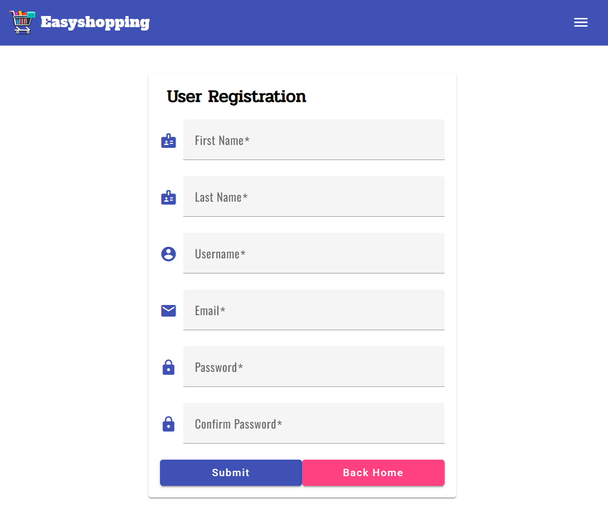

### Login

  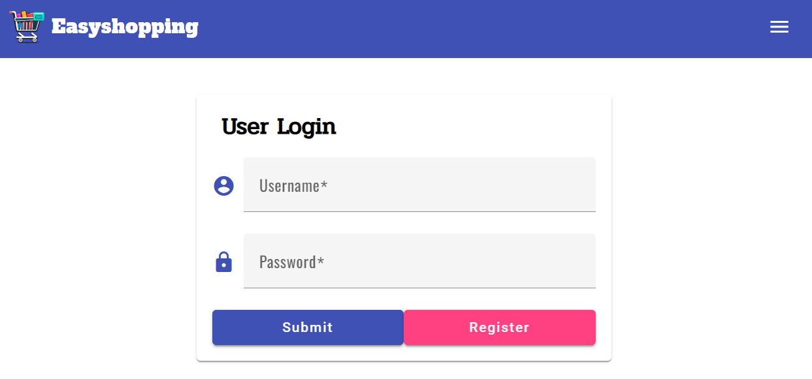

### Shopping

    <place holder>

### Checking Out

    <place holder>  

### Account Management

#### Overview

The accounts panel is where users can do things like:

- Update their information
- Change their password
- See their past orders
- Make changes to their addresses

##### Dashboard

When a user initially gets to the accounts panel, they will see the following:

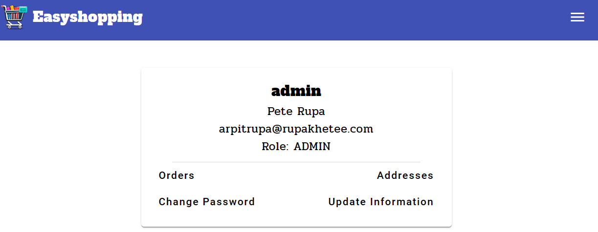

The information presented is as follows:

  - The **username** in bold
  - The user's **full name**
  - The user's **email**
  - The user's **current role/authorization**

The user is also presented with buttons they can click to navigate to pages where where can perform various actions on their account.

##### Addresses

Clicking on the `Addresses` button, renders a children-route component (`/account/addresses`) of the `/account` route. 

This will render the following:

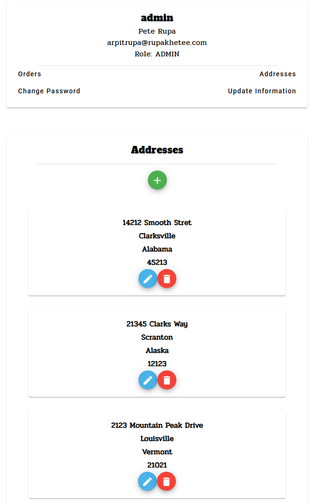

In this route, all the user's associated addresses are rendered in individual `cards`. 

Users can add a new address to their account by clicking the green "`+`" button. 

Users can also edit or delete specific addresses by clicking on the blue or red buttons respectively. 

###### Add Address

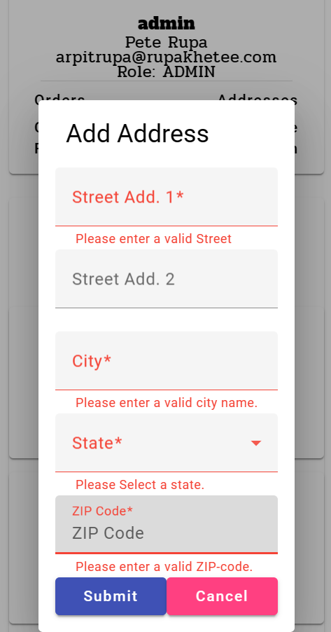

Upon clicking the green "+" button, the `address-form-component` is rendered as a `dialog`. 

The form handles validation and will not allow users to input invalid characters, or submit and invalid form.

Upon clicking "Submit" the valid `address` will be added to the database and the window will refresh, displaying the new `address`. 

###### Edit Address

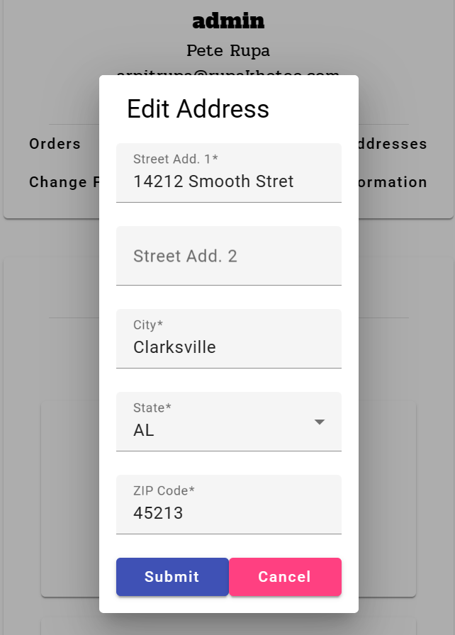

Similar to adding an address, upon clicking the blue button of any card, will render a `address-form-component` prefilled with the specific address's information.

The form handles validation and will not allow users to input invalid characters, or submit and invalid form.

Upon clicking "Submit" the valid `address` will be edited and snet to the database and the window will refresh, displaying the edited `address`.

###### Delete Address

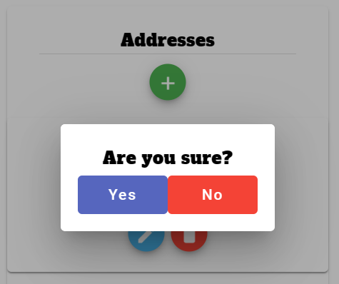

Upon clicking the delete button for any `address` card will render a `dialog` that will ask if the user is sure they want to delete the address.

Clicking "No" will close the `dialog` and clicking `Yes` will delete the address in the database and reload the window.

##### Update Information

Clicking on the `Update Information` button, renders a children-route component (`/account/updateInfo/{id}`) of the `/account` route.

This will render the following:

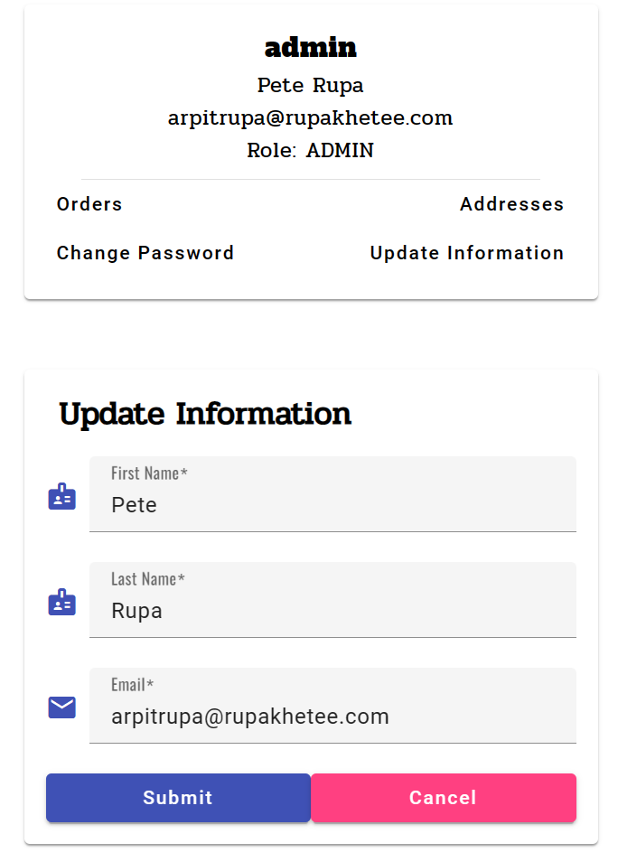

In this route, the user is presented pre-populated form that contains their current information.

Users can update the form, and provided they submit valid information in the fields, upon clicking "Submit" their information will be updated in the database.

##### Change Password

Clicking on the `Update Information` button, renders a children-route component (`/account/changePassword/{id}`) of the `/account` route.

This will render the following:

  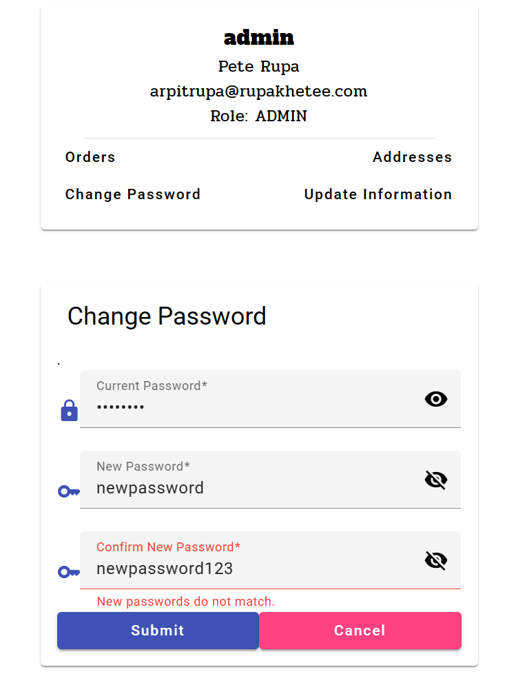

In this route, the user is with an `changePassword` component that renders a form for the user to change their password.

Clicking the eyes on the right of each field will toggle the "show password" feature so users can see their inputs into the fields should they choose to do so.

The "Current Password" field will be authenticated by the backend, and the input for the "New Password" and "Confirm New Password" fields must match for the request to reach to backend.

##### Orderes

    <place holder> 

### Posting a Listing

    <place holder> 

## Admin Experience

Here is the outline of the admin experience along with screenshots of the process.

### Login

### Managing Users

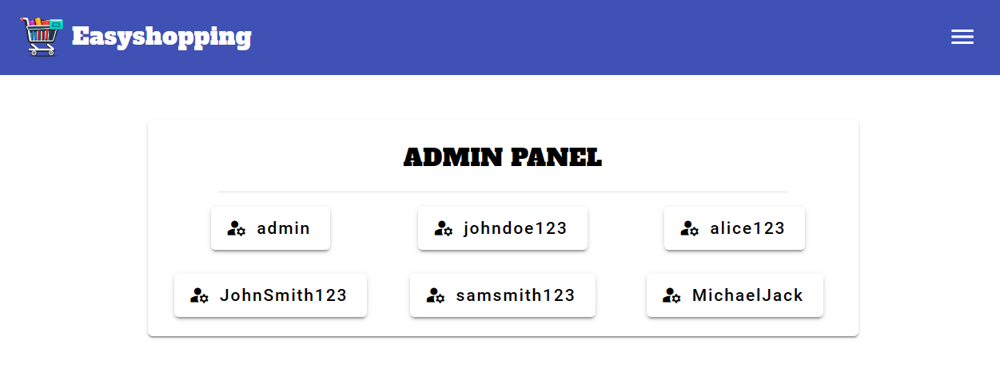

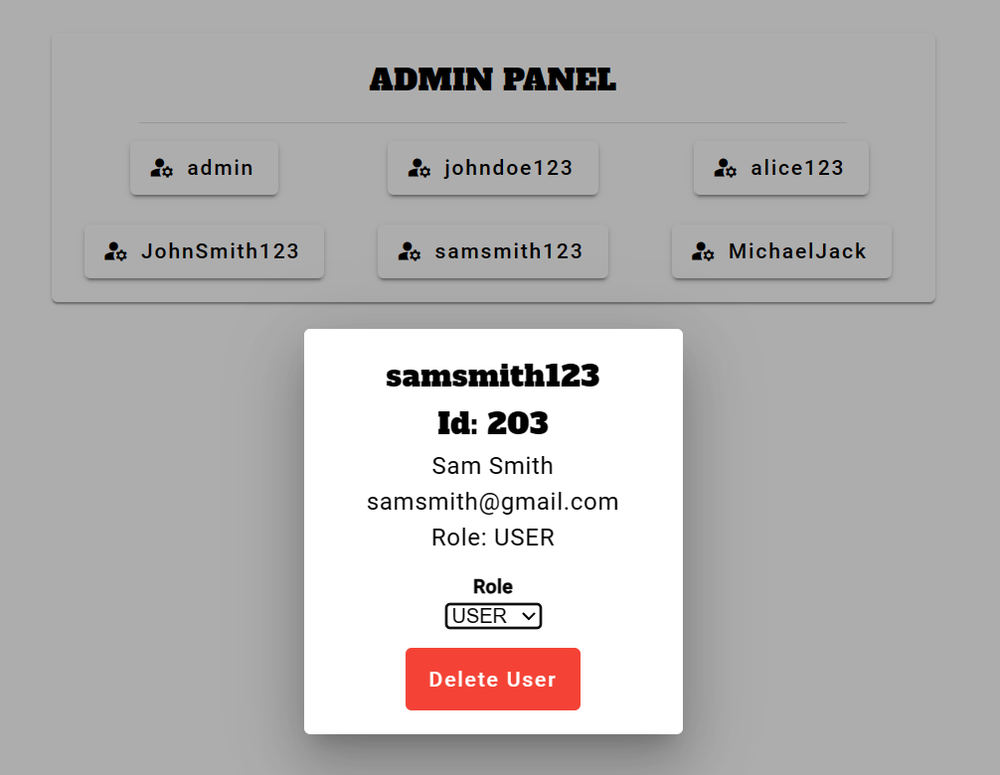

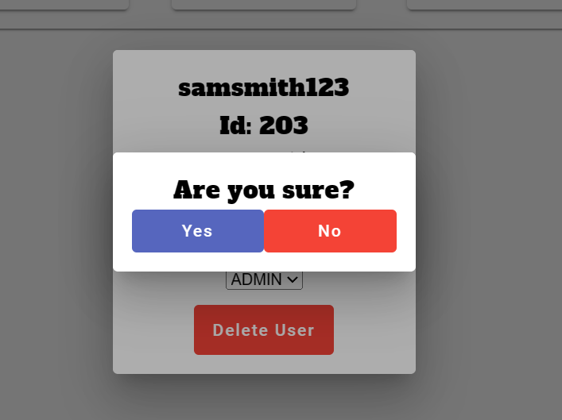

### Managing Listings

    <place holder> 

